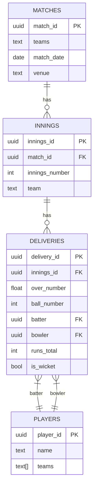

# CricEcho - Still in Build Phase

Imagine a dynamic IPL platform that transforms live cricket data into captivating insights—where every ball tells a story, every match has a historical twin, and AI-generated commentary keeps fans on the edge of their seats!

🔥 The Vision
A Python-powered (Flask) analytics hub that:

📊 Ingests live IPL match data (via Google API/CricAPI) in real-time

💾 Stores rich historical ball-by-ball records in a structured JSON database

🤖 Uses ML to find eerily similar past match moments—comparing teams, players, match conditions, and game stats

🎙️ Generates witty, engaging commentary for every delivery using AI

🔄 Updates in real-time with minimal latency, keeping fans hooked

✨ Key Features
- 🔍 Live Similarity Engine – "This match mirrors RCB vs. MI 2023!"
- 📈 Ball-by-Ball AI Narration – "Kohli takes on Rashid just like in the 2019 thriller!"
- 🖼️ Player Visuals – Instantly display batter/bowler images & stats
- ⚡ Real-Time Sync – Lightning-fast updates without overloading servers
- 📱 Fan-Friendly UI – Clean, intuitive, and packed with insights

🛠️ Tech Stack
Backend: Python (Flask/Django)

Database: PostgreSQL (structured JSON storage)

AI/ML: Scikit-learn (similarity), Transformers (commentary)

APIs: Google Cricket API / CricAPI (live data)

Frontend: React (optional) or server-rendered templates

## 📌 Overview

A real-time IPL match analysis platform that:
- Fetches live ball-by-ball data from CricAPI
- Stores historical match data in PostgreSQL
- Finds similar match situations using ML
- Generates AI-powered commentary
- Works REST and GraphQL APIs

## 🌟 Features

### Live Match Integration
- Real-time ball-by-ball updates from CricAPI
- Current match status tracking
- Last 100 balls caching system

### Advanced Analytics
- ML-powered similarity engine (Scikit-learn)
  - Match-to-match comparisons
  - Over-to-over comparisons
  - Ball-to-ball comparisons
- Statistical analysis of:
  - Batting performance
  - Bowling performance
  - Partnership analysis

### AI Commentary
- Context-aware match commentary
- Similarity comparison narratives
- GPT-2 based text generation

### Data Management
- PostgreSQL database with 4 core tables:
  - `matches` - Match metadata
  - `innings` - Inning information
  - `deliveries` - Ball-by-ball data
  - `players` - Player profiles


### APIs
- **CricAPI** (Live match data)
- **Google Cricket API** (Fallback data source)

## 🚀 Installation

### Prerequisites
- Python 3.9+
- PostgreSQL 12+ 
- Graphql Engine - Hasura

### Setup

1. **Clone the repository**
   ```bash
   git clone https://github.com/yourusername/ipl-analysis-platform.git
   cd ipl-analysis-platform
   ```

2. **Set up environment**
   ```bash
   python -m venv venv
   source venv/bin/activate  # Linux/Mac
   venv\Scripts\activate     # Windows
   pip install -r requirements.txt
   ```

3. **Configure environment variables**
   Create `.env` file:
   ```ini
   # Database
   DB_HOST=localhost
   DB_NAME=ipl_data
   DB_USER=postgres
   DB_PASSWORD=yourpassword
   DB_PORT=5432

   # APIs
   CRICAPI_KEY=your_cricapi_key
   GOOGLE_API_KEY=your_google_key

   # App
   FLASK_ENV=development
   ```

4. **Database setup**
   ```bash
   psql -U postgres -c "CREATE DATABASE ipl_data;"
   python -m migrations.run
   ```

5. **Run Hasura (optional)**
   ```bash
   docker-compose up -d
   ```

## 🏗️ Project Structure

```
ipl-analysis-platform/
├── api/                   # Flask REST endpoints
├── graphql/               # GraphQL schema and queries
├── services/              # Business logic
│   ├── live_match.py      # Live data processing
│   ├── similarity.py      # ML comparisons
│   └── commentary.py      # AI commentary
├── migrations/            # Database migrations
├── utils/                 # Utilities
├── requirements.txt       # Python dependencies
├── app.py                 # Flask application
└── README.md              # This file
```

## 📡 API Endpoints

### REST API (Flask)
| Endpoint | Method | Description |
|----------|--------|-------------|
| `/live/matches` | GET | List all live IPL matches |
| `/live/matches/<id>` | GET | Get ball-by-ball data |
| `/live/matches/<id>/similar` | GET | Find similar historical moments |
| `/matches/<id>` | GET | Get match details |
| `/players/<id>` | GET | Get player profile |

### GraphQL (Hasura)
```graphql
query {
  matches {
    id
    date
    teams
    innings {
      deliveries {
        batter
        bowler
        runs
      }
    }
  }
}
```

## 🤖 ML Features

### Similarity Engine
- **Match Similarity**: Compares current match with historical data
- **Over Similarity**: Finds similar overs from past matches
- **Ball Similarity**: Identifies similar ball situations

### Commentary Generation
- Contextual analysis of match situations
- Comparison with historical moments
- Natural language generation

## 📊 Database Schema



## 🧪 Testing

Run test suite:
```bash
python -m pytest tests/
```

Test coverage:
```bash
pytest --cov=.
```

## 🚨 Rate Limits

- **CricAPI**: 100 requests/day (free tier)
- **Google API**: 1000 requests/day (free tier)

Implement caching for production use.

## 📜 License

MIT License

## 📬 Contact

For questions or support: [your.email@example.com](mailto:vsaraswa@uci.edu)
